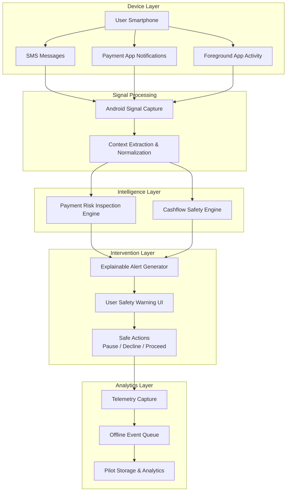
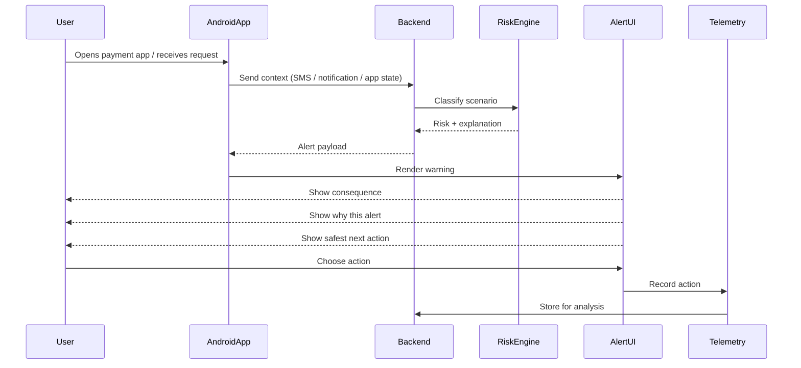
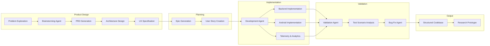
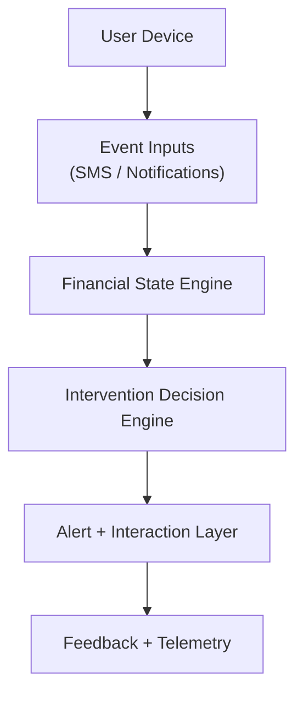

> 🧠 Agentic AI System for Financial Safety • 📱 Android + ⚡ FastAPI • 🔍 Explainable Interventions • 📊 Research-Driven


# 🧠 Agentic Financial Safety Platform

> A research-driven system that helps underbanked users understand risky digital financial moments using phone-native signals and explainable AI.

---

## 🚀 Overview

This project explores how **agentic AI systems can design and implement real-world software products**, while solving a critical problem in financial inclusion:

> Helping users make safer financial decisions *at the moment of action*.

Instead of building another finance app, this system acts as a:

### 👉 Financial Safety & Comprehension Layer

It observes **phone-native signals** (SMS, notifications, app usage) and converts them into:

- explainable financial warnings  
- real-time guidance  
- safe next actions  

---

## ⚠️ Problem

Millions of users already have:

- bank accounts  
- UPI / payment apps  
- digital transactions  

Yet they struggle with:

- confusing **collect payment requests**
- refund / reward scams  
- ambiguous payment prompts  
- lack of awareness of spending impact  

These decisions happen **within seconds**, often leading to:

- accidental payments  
- fraud  
- poor financial decisions  

---

## 💡 Solution

A **real-time financial safety system** that:

- detects risky or confusing financial situations  
- explains them in simple language  
- suggests safe actions  
- measures whether interventions are useful  

Designed for:

- low-confidence users  
- multilingual environments  
- low-infrastructure conditions  

---

## 🚀 Why This is Different

- Does NOT rely on bank integrations  
- Uses phone-native signals (SMS, notifications, app usage)  
- Focuses on decision-time safety (not dashboards)  
- Combines product thinking + system design + AI workflows  
- Built using AI agent orchestration instead of manual coding  

> This project explores a new paradigm: **AI as a system builder, not just a tool.**

---

## 🏗️ System Architecture: Financial Safety Layer


---

## ⚡ Decision-Time Intervention Flow


---

## 🤖 AI-Orchestrated Development Architecture


---

## ✨ Key Features

### 🔍 Payment Risk Detection

- Detects collect requests, scams, ambiguous prompts
- Explains consequences before approval

### 💰 Cashflow Safety

- Uses SMS signals to estimate financial pressure
- Protects essential spending

### 🧠 Explainable Alerts

Each alert includes:

>1. what is happening
>2. why this alert
>3. safest next action

### 📊 Research Telemetry

- useful vs noisy alerts
- user actions
- cohort/language analysis

### 📡 Offline Resilience

- queues events offline
- idempotent replay

---

## 🛠️ Tech Stack

### Frontend

- Android (Kotlin)
- SMS + Notification listeners
- Overlay UI

### Backend

- FastAPI
- Decision engine
- Explainability layer
- SQLite storage

### Research Layer

- telemetry analytics
- pilot evaluation
- cohort slicing

---

## 🧪 Research Focus

This is a **research prototype (not production fintech).**

Key questions:

- Which alerts actually help users?
- How to reduce alert fatigue?
- How to personalize financial safety?

---

## 🔬 Deep Dive (Technical)

---

### Why this exists

This is intentionally a **research-oriented prototype** to test:

- intervention timing
- alert clarity
- user behavior

---

### Current MVP Scope

Focuses on:

- risky payment detection
- explainable alerts
- cashflow guidance
- telemetry + pilot analytics

Not intended to be:

- a banking app
- a lending/savings platform
- a full financial advisor

---

## 🏗️ Architecture (High level )


The system captures real-time financial signals from the device,
analyzes risk, and intervenes at decision time with explainable guidance.

---

## Backend Structure

- `backend/main.py` → app entry
- `backend/literacy/decisioning.py` → core logic
- `backend/literacy/context.py` → context scoring
- `backend/pilot/storage.py` → telemetry storage
- `backend/routes/pilot.py` → analytics routes

---

## Research System

- pilot telemetry storage
- usefulness vs noise analysis
- cohort-based evaluation
- synthetic simulator

---

## Run Locally

```bash
python -m venv .venv
pip install -r requirements.txt
uvicorn backend.main:app --reload
```

---

## Key Insight

The future of software development is not just writing code —
it is designing systems that AI agents can build.

---

## 🔗 Repository

## 📱 Android App
https://github.com/karanakatle/Python-OOS-Project/tree/main/ArthamantriAndroid

## 🧠 Backend System
https://github.com/karanakatle/Python-OOS-Project

---

## 🤝 Discussion

Open to conversations on:

- agentic AI
- fintech systems
- system design
- financial inclusion

---