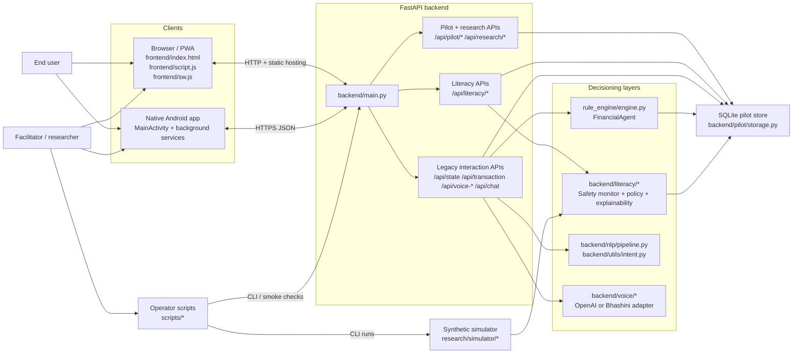
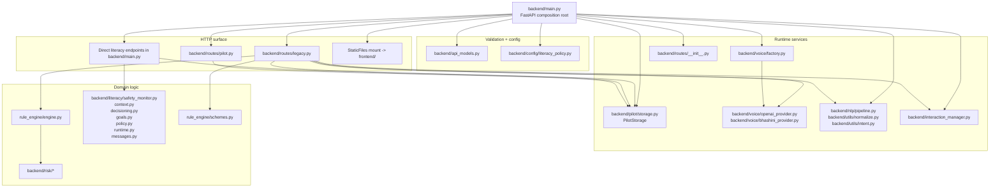
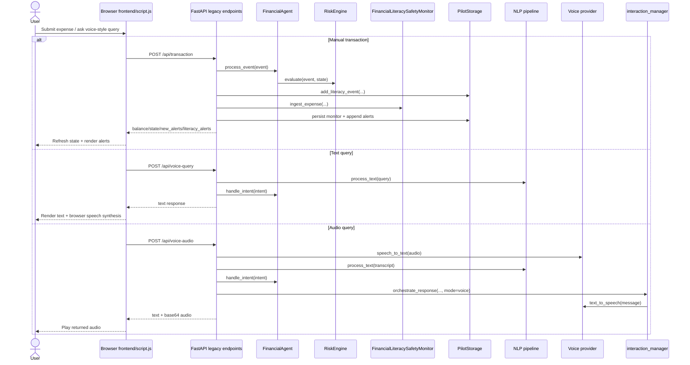
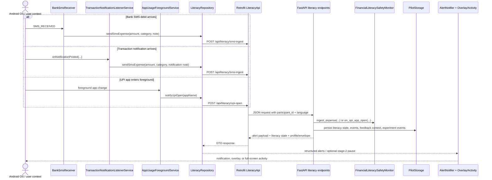
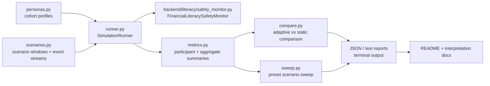

# Repository Architecture

This document is the canonical architecture reference for the repository. It describes the live runtime surfaces, the supporting research/simulator stack, and the main interfaces between browser, Android, backend, storage, and voice integrations.

The companion file `docs/architecture_audit.md` contains the file-by-file inventory that backs this document.

## 1. System Context

### Reading the system

- The browser frontend is served by the same FastAPI app that exposes the JSON endpoints.
- The Android app is a separate native client that sends SMS/UPI-derived events into the backend and renders alert payloads locally.
- Two decision layers coexist:
  - `rule_engine/*` powers the original balance, guidance, and fraud-like legacy agent behavior.
  - `backend/literacy/*` powers participant-scoped literacy safety monitoring, explainability, policy tuning, and research instrumentation.
- `PilotStorage` is the durable boundary for pilot state, feedback, experiment assignments, and alert context.
- `research/simulator/*` reuses the literacy safety model to evaluate policy variants offline.

## 2. Backend Containers And Layers

### Backend composition notes

- `backend/main.py` is both the app bootstrap and a major controller module: it wires routers, configures CORS, instantiates storage and voice providers, defines literacy endpoints directly, and mounts the web frontend.
- `backend/routes/legacy.py` contains the older interaction surface for manual transactions, voice queries, chat, and schemes.
- `backend/routes/pilot.py` isolates consent, feedback, analytics, grievances, and experiment logging endpoints.
- `backend/literacy/runtime.py` reconstructs and persists `FinancialLiteracySafetyMonitor` from `PilotStorage`.
- `backend/literacy/context.py`, `decisioning.py`, `goals.py`, and `policy.py` enrich raw threshold alerts into explainable, participant-aware alerts.

## 3. Legacy Web / Manual Interaction Flow

### What is specific to the legacy path

- The browser client keeps a stable `participant_id` in `localStorage`.
- `FinancialAgent` owns transient in-memory participant state for the legacy surface.
- The literacy stack can still augment manual expense events, but the primary UI contract remains the older `/api/state`, `/api/alerts`, and `/api/transaction` loop.

## 4. Android Monitoring And Alert Delivery Flow

### What is specific to the Android path

- Android uses device-scoped `participant_id` derived from `ANDROID_ID`.
- SMS, notification, and foreground-app monitoring are three separate event sources that converge into the same literacy API surface.
- `AlertNotifier`, `OverlayAlertWindow`, and `AlertDisplayActivity` are the UI delivery layer for backend-issued alerts.
- The Android app also drives onboarding, consent, Money Setup Lite, and feedback submission against the pilot endpoints.

## 5. Research / Simulation Flow

### Why the simulator matters to architecture

- The simulator is not a separate product runtime, but it is a first-class architecture consumer of the literacy safety model.
- It exercises adaptive vs static policy variants with deterministic persona/scenario inputs and produces research-facing summaries.
- The simulator is the main offline validation path for changes to warning thresholds, warmup behavior, severity policy, and user-outcome assumptions.

## 6. Public Interfaces

### HTTP interfaces

- Legacy web/manual APIs:
  - `GET /api/state`
  - `GET /api/alerts`
  - `POST /api/transaction`
  - `POST /api/voice-query`
  - `POST /api/voice-audio`
  - `POST /api/chat`
  - `POST /api/confirm-savings`
  - `POST /api/schemes`
- Literacy/pilot APIs:
  - `POST /api/literacy/sms-ingest`
  - `POST /api/literacy/upi-open`
  - `GET /api/literacy/status`
  - `GET/POST /api/literacy/policy`
  - `GET/POST /api/literacy/essential-goals`
  - `GET /api/literacy/debug-trace`
  - `GET /api/literacy/storage-health`
  - `POST /api/literacy/reset`
  - `POST /api/literacy/reset-hard`
  - `POST /api/literacy/alert-feedback`
  - `POST /api/literacy/essential-feedback`
  - `GET /api/pilot/meta`
  - `POST /api/pilot/consent`
  - `POST /api/pilot/feedback`
  - `GET /api/pilot/summary`
  - `GET /api/pilot/analytics`
  - `POST /api/pilot/app-log`
  - `POST /api/pilot/grievance`
  - `GET /api/pilot/grievance`
  - `POST /api/pilot/grievance/status`
  - `POST /api/research/assignment`
  - `POST /api/research/event`
  - `GET /api/research/export/experiment-events`

### Backend configuration inputs

- Voice/config selection:
  - `VOICE_PROVIDER`
  - `OPENAI_API_KEY`
- Storage and web serving:
  - `PILOT_DB_PATH`
  - `CORS_ALLOWED_ORIGINS`
- Literacy policy tuning:
  - `LITERACY_DAILY_SAFE_LIMIT`
  - `LITERACY_WARNING_RATIO`
  - `LITERACY_STAGE1_MESSAGE`
  - `LITERACY_STAGE2_OVER_LIMIT_TEMPLATE`
  - `LITERACY_STAGE2_CLOSE_LIMIT_MESSAGE`
  - `LITERACY_WARMUP_DAYS`
  - `LITERACY_WARMUP_SEED_MULTIPLIER`
  - `LITERACY_WARMUP_EXTREME_SPIKE_RATIO`
  - `LITERACY_CATASTROPHIC_ABSOLUTE`
  - `LITERACY_CATASTROPHIC_MULTIPLIER`
  - `LITERACY_CATASTROPHIC_PROJECTED_CAP`

### Android client interfaces

- Build-time inputs:
  - `API_BASE_URL` / `DEFAULT_BASE_URL`
  - `PRIVACY_POLICY_URL`
- Runtime Android platform interfaces:
  - SMS broadcast receiver
  - notification listener service
  - usage-stats foreground service
  - overlay and full-screen alert presentation

### Storage boundary

- `backend/pilot/storage.py` is the only durable storage implementation in the repo.
- It owns SQLite schema creation, WAL configuration, participant policy state, literacy events, alert features, feedback, experiment assignment/events, grievances, and essential-goal learning tables.
- Runtime legacy `FinancialAgent` state is in-memory and participant-scoped inside `backend/main.py`; it is distinct from SQLite-backed literacy state.

## 7. Architectural Tensions To Keep In Mind

- `backend/main.py` is both composition root and feature controller; it currently contains direct literacy endpoint implementations in addition to router wiring.
- There are two alerting models by design:
  - legacy deterministic agent alerts for the browser/manual flow
  - literacy-stage alerts with explainability and persistence for Android/pilot flows
- Android has two ingestion paths for expense-like events (`BankSmsReceiver` and `TransactionNotificationListenerService`) that intentionally converge on the same backend endpoint.
- The web frontend and native Android app consume different subsets of the same backend, so API additions tend to be surface-specific rather than universally shared.
